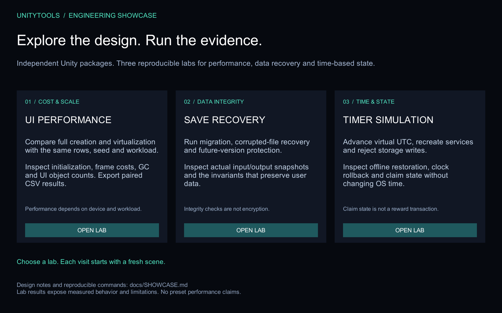

# UnityTools

Unity 2022.3 이상에서 UI, Timer, Benchmark, Persistence 기능을 각각 독립 설치할 수 있는 UPM 패키지입니다. 데모 프로젝트는 Unity 6.3 LTS를 사용하고 패키지의 최소 지원 버전은 2022.3을 유지합니다. 저장소는 하나지만 package assembly와 dependency는 분리되어 있습니다. Benchmark와 Persistence도 1.0.0 고정 태그로 배포합니다.

## 포트폴리오 데모



`UnityTools/Assets/Showcase/Showcase.unity`는 스크롤 성능 비교, 저장 복구, 시간 시뮬레이션의 진입 화면입니다. 데모 프로젝트에서 `Tools > UnityTools > Configure Showcase Build Scenes`로 시작 장면과 세 실험실을 등록하고 Play합니다. 각 실험실 오른쪽 위의 `< SHOWCASE`로 돌아올 수 있습니다.

- [5분 시연과 재현 검증](docs/SHOWCASE.md): 실행 순서, 확인할 결과와 한계
- [설계 선택](docs/DESIGN.md): 패키지 경계, deque·pool 재사용, 저장 보호, 시간 주입
- [통과한 정적 CI](https://github.com/aassder95/UnityTools/actions/runs/36803052811): 배포 계약·회귀 테스트·샘플 사본 검사

Showcase는 개발 프로젝트 전용이며 개별 UPM 설치에는 포함되지 않습니다. 실제 기기에서 측정한 성능 결과를 함께 기록할 수 있도록 각 실험실에서 입력·출력과 측정 조건을 제공합니다.

## 패키지

| 패키지 | 버전 | Assembly | 주요 책임 |
| --- | --- | --- | --- |
| `com.aassder95.unitytools.ui` | `2.0.0` | `UnityTools.Ui` | MVP, navigation, transition, focus, safe area, DynamicScroll |
| `com.aassder95.unitytools.timer` | `1.0.0` | `UnityTools.Timer` | Task/Period Timer, service/handle, UTC, persistence |
| `com.aassder95.unitytools.benchmark` | `1.0.0` | `UnityTools.Benchmark` | Main Thread, GC, memory, custom marker 측정 및 CSV 출력 |
| `com.aassder95.unitytools.persistence` | `1.0.0` | `UnityTools.Persistence` | 버전형 저장, migration, 검증, 백업 복구 |

## 설치

Unity Package Manager의 `Add package from git URL...`에 필요한 패키지 주소를 입력합니다.

UI:

```text
https://github.com/aassder95/UnityTools.git?path=/UnityTools/Packages/com.aassder95.unitytools.ui#unitytools-ui/v2.0.0
```

Timer:

```text
https://github.com/aassder95/UnityTools.git?path=/UnityTools/Packages/com.aassder95.unitytools.timer#unitytools-timer/v1.0.0
```

Benchmark:

```text
https://github.com/aassder95/UnityTools.git?path=/UnityTools/Packages/com.aassder95.unitytools.benchmark#unitytools-benchmark/v1.0.0
```

Persistence:

```text
https://github.com/aassder95/UnityTools.git?path=/UnityTools/Packages/com.aassder95.unitytools.persistence#unitytools-persistence/v1.0.0
```

[Benchmark API·CSV 계약](UnityTools/Packages/com.aassder95.unitytools.benchmark/Documentation~/api.md), [Persistence API](UnityTools/Packages/com.aassder95.unitytools.persistence/README.md), [정식 릴리스 검증](docs/RELEASE_PACKAGES.md)을 참고하세요.

Persistence의 **Save Recovery Lab** 샘플은 변환·손상 복구·미래 버전 보호를 실행하고 입력/출력 파일을 비교하는 데모입니다. [샘플 안내](UnityTools/Packages/com.aassder95.unitytools.persistence/Samples~/Save%20Recovery%20Lab/README.md)에서 여섯 실험의 검증 조건을 확인할 수 있습니다.

UI 기본 패키지는 Timer와 Input System에 의존하지 않습니다. Input System Back 입력이 필요하면 프로젝트에 `com.unity.inputsystem`을 추가하면 `UnityTools.Ui.InputSystem` 선택 assembly가 활성화됩니다.

## Breaking migration

이번 UI 2.0은 호환 shim을 제공하지 않는 breaking release입니다. `UnityTools.Util.*`, 전역 Manager/Singleton, 범용 pooling/persistence API를 사용하던 프로젝트는 [MIGRATION.md](MIGRATION.md)를 따라 명시적인 package API로 이전해야 합니다.

## 검증

PR 정적 검사 CI는 네 패키지의 manifest·assembly 경계·meta GUID·배포 파일과 샘플 사본을 검사합니다. 로컬에서도 `python tools/verify-upm.py`, `python -m unittest discover -s tools/tests -p test_verify_upm.py -v`로 실행할 수 있습니다. Unity 실행 검증과는 별개이며, runner·라이선스 조건과 연결 계획은 [CI 안내](docs/CI.md)를 참고하세요.

GitHub 실행 Summary에서 검사별 결과를 확인하고 `upm-static-report` artifact에서 배포 오류의 파일 경로와 사유를 확인할 수 있습니다. 로컬 JSON 출력은 `python tools/verify-upm.py --report <출력 경로>`를 사용합니다.

```powershell
powershell.exe -NoProfile -ExecutionPolicy Bypass -File .\tools\verify-release.ps1 -Release
powershell.exe -NoProfile -ExecutionPolicy Bypass -File .\tools\test-upm-packages.ps1 -Source Remote
```

UPM 검증 스크립트는 Timer 단독, UI 단독(Input System 없음), UI+Input System 프로젝트를 각각 생성하고 패키지 PlayMode 테스트를 실행합니다.

Unity 6.3에서 Git 설치, 샘플 Import, PlayMode 테스트, Windows Development Build까지 확인하려면 다음 명령을 실행합니다.

```powershell
powershell.exe -NoProfile -ExecutionPolicy Bypass -File .\tools\test-upm-compatibility.ps1
```

기본 Editor는 `6000.3.20f1`이며, 검증 대상 원격 커밋은 스크립트의 `UiRef`, `TimerRef`, `BenchmarkRef`, `PersistenceRef`에 고정합니다. 개발 브랜치의 검증이며 release tag 검증과 구분합니다. `-Scenarios timer`처럼 한 시나리오만 선택할 수 있고, 로컬 변경은 `-Source Local`로 검증합니다. 실행 결과와 로그, packages-lock, 테스트 XML, 빌드는 출력된 임시 프로젝트 경로에 보존합니다. Editor 설치 경로가 다르면 `-UnityPath`를 지정하세요.

기본 시나리오는 Timer, UI, UI+Input System, Benchmark, Persistence, UI Performance Lab입니다. UI와 Benchmark의 단독 프로젝트는 샘플 의존성이 없는 상태를 검증하고, UI 샘플은 Input System 조합에서, 성능 실험실은 Benchmark+UI 조합에서 Import합니다. 장면의 누락 스크립트도 검사합니다. Player 빌드 성공은 실제 실행, 화면 배치, 터치 또는 대상 기기 성능 검증을 의미하지 않습니다.

새 Save Recovery Lab은 `-Source Local -Scenarios save-lab`으로 검증합니다. 기본 원격 커밋에는 이 샘플이 포함되어 있지 않습니다. Persistence 코어 단독 검증은 uGUI 의존성 없이 유지하고, `save-lab`에서 uGUI와 샘플을 추가합니다.

새 Timer Simulation Lab은 `-Source Local -Scenarios timer-lab`으로 검증합니다. 가상 UTC·오프라인 복원·역행 보정·저장 실패·수령 상태를 비교합니다. 기존 `timer` 시나리오는 기존 Timer Sample Scene만 Import하고, `timer-lab`에서 uGUI와 실험실을 추가합니다. 기본 원격 커밋과 기존 Timer release tag에는 실험실이 포함되어 있지 않습니다.

2026-09-30, Unity `6000.3.20f1`에서 빈 프로젝트별 Git URL 설치를 검증했습니다. UI·Timer·Benchmark는 `18665ab98b9bc97c9f664a6a0407ba1353f59145`, Persistence는 `472a08ef24418e81045dcc66109c1a9b7c86606b` 기준입니다.

| 시나리오 | 샘플 Import | PlayMode 테스트 | Windows Development Build |
| --- | --- | --- | --- |
| Timer 단독 | Timer Sample Scene | 17/17 | 성공 |
| UI 단독 | 미사용 | 24/24 | 성공 |
| UI + Input System | UI Sample Scene | 25/25 | 성공 |
| Benchmark 단독 | 미사용 | 4/4 | 성공 |
| Persistence 단독 | 등록된 샘플 없음 | 6/6 | 성공 |
| Benchmark + UI | UI Performance Lab | 9/9 | 성공 |

Unity 6.3의 lock 파일에서 uGUI `2.0.0`, TMP `5.0.0`, Test Framework `1.6.0` 내장 패키지 해석을 확인했습니다. Windows 빌드는 Mono backend로 검증했고 Android/iOS, IL2CPP, 직접 화면 조작과 실제 기기 성능은 이 결과에 포함하지 않습니다.

## 라이선스

UnityTools 자체 코드는 [MIT License](LICENSE)로 배포됩니다. 프로젝트 개발용 `Assets/Plugins`의 DOTween Standard는 UPM 패키지에 포함되지 않으며 원 저작권자의 라이선스를 따릅니다. 출처와 버전은 [THIRD_PARTY_NOTICES.md](THIRD_PARTY_NOTICES.md)를 확인하세요.

보안 정리로 Git 이력이 재작성됐으므로 정리 이전 clone은 재사용하지 말고 새로 clone해야 합니다. 자세한 기록은 [SECURITY_CLEANUP.md](SECURITY_CLEANUP.md)에 있습니다.
