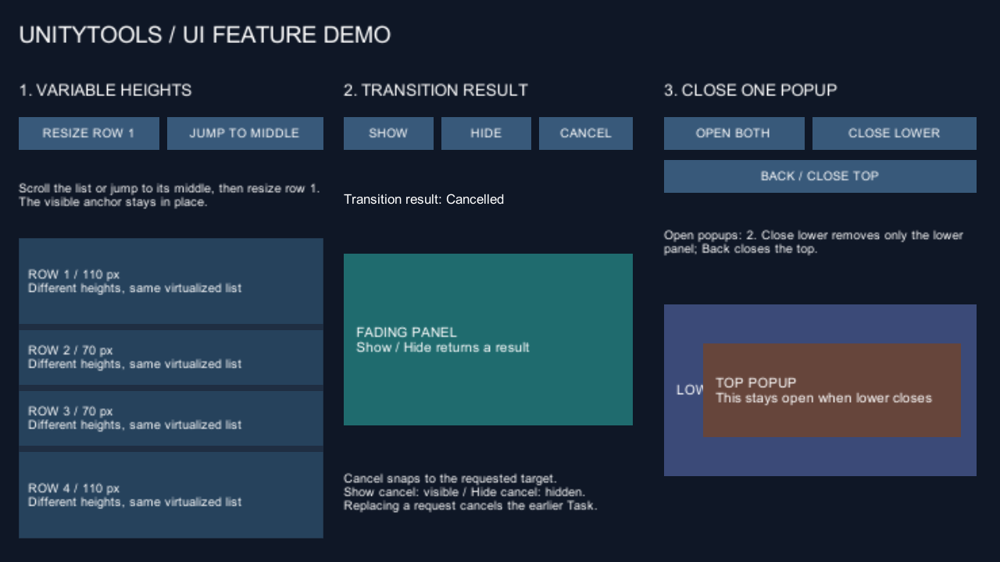

# UI Sample Scene

## 요구 사항

- Unity 2022.3 이상
- TextMeshPro 3.0.7
- 기존 SampleScene의 Input System 입력을 사용할 경우 Input System 1.14.0

## 실행

1. Package Manager에서 `UI Sample Scene`을 Import합니다.
2. `Scenes/SampleScene.unity`를 엽니다.
3. Play Mode에 진입합니다.
4. Sample Lobby에서 Inventory, Rank를 선택합니다.
5. 각 화면의 Refresh, Random 테스트 버튼을 실행합니다.
6. 화면 아래 Back 버튼으로 Lobby로 돌아옵니다.

## 확인할 프레임워크 흐름

- `UiManager`가 `UiNavigator`를 생성하고 Sample Lobby를 첫 Screen으로 등록합니다.
- Sample 선택 시 모듈 Presenter가 Screen 스택에 Push됩니다.
- Back 버튼은 `UiNavigator.TryHandleBack()`을 호출해 현재 모듈을 닫고 Lobby를 복원합니다.
- `SampleModuleBase`가 `IPresenter` 수명주기와 표시 상태 계약을 구현합니다.

## 새 기능 데모

현재 개발 소스의 샘플에는 `Scenes/UiFeatureDemo.unity`도 포함됩니다. 기존 `unitytools-ui/v2.0.0` tag에는 포함되지 않습니다. 이 장면은 기존 Input Manager를 사용하며 Active Input Handling을 Input Manager 또는 Both로 설정합니다. Timer 패키지는 필요하지 않습니다.

장면을 열고 Play한 뒤 아래 순서로 확인합니다.

1. 왼쪽의 높이가 다른 60개 행을 스크롤합니다. **JUMP TO MIDDLE** 후 **RESIZE ROW 1**을 누르면 첫 행 높이가 바뀌면서 보고 있던 행의 위치가 유지됩니다. 다시 누르면 원래 높이로 돌아갑니다. 표시되는 객체 수는 전체 60개보다 적습니다.
2. 가운데 **SHOW** 또는 **HIDE**를 누르고 기다리면 `Completed`를 표시합니다. 1.5초 fade 도중 **CANCEL**을 누르면 `Cancelled`를 표시합니다. Show 취소는 표시 상태, Hide 취소는 숨김 상태로 맞춥니다. 새 요청이 이전 요청을 대체하면 화면은 최신 요청의 결과를 표시합니다.
3. 오른쪽 **OPEN BOTH**로 두 팝업을 엽니다. **CLOSE LOWER**는 아래 팝업만 닫고 위 팝업을 유지합니다. 다시 눌러도 위 팝업은 유지됩니다. **BACK / CLOSE TOP**은 맨 위 팝업을 닫습니다. 예제 조작 버튼은 navigation 영역 밖에 있어 모달 상태에서도 조작할 수 있습니다.

`Tools > UnityTools > Create UI Feature Demo`는 새 위치에 장면을 생성하고 모든 필수 참조를 연결합니다. 생성기는 Editor에서만 포함됩니다. 실행 중 오브젝트 검색으로 참조를 복구하지 않습니다. Inspector의 행 높이와 transition 지속 시간으로 데이터를 조정할 수 있습니다.

`Scripts/Features/Tests`의 Play Mode 테스트는 `UiFeatureDemo`를 Build Settings에 등록한 상태에서 실행합니다. 목록 위치·전환 결과·팝업 수·비활성화 후 재활성화를 검사하며, 화면 배치·실제 입력·모바일 Safe Area 검증과는 구분합니다.

2026-10-06, Unity `2022.3.62f3`과 `6000.3.20f1`에서 생성 장면의 버튼 시나리오 Play Mode 테스트 1/1 및 Windows Development Build(Mono)를 통과했습니다. 필수 참조의 YAML 연결과 장면/스크립트 사본 일치를 확인했습니다. Unity 6에서 1280×720 Canvas 렌더도 확인했습니다. 실제 포인터·터치 조작, 다른 화면 비율·모바일 Safe Area·IL2CPP는 미검증입니다.

검증 증거는 아래 임시 프로젝트의 `feature-builder.log`, `feature-results.xml`, `feature-tests.log`, `feature-build.log`, `build-result.txt`에 보존했습니다.

- `C:/Users/search/AppData/Local/Temp/UnityTools-Compatibility-2022.3.62f3-7d0e84e169e2445f8448970963847c72/ui`
- `C:/Users/search/AppData/Local/Temp/UnityTools-Compatibility-6000.3.20f1-b50d1c74e20443f798dc2785ad072a8e/ui` (Canvas 캡처: `feature-capture.xml`, `feature-preview.png`)
