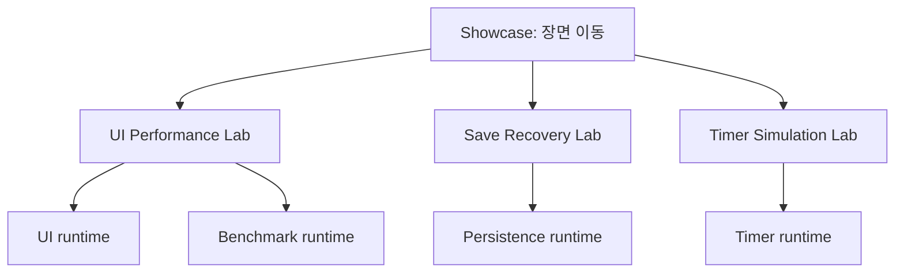

# 설계 선택과 한계

## 패키지 경계

기능별 runtime assembly와 dependency를 분리합니다. UI 기본 패키지는 uGUI/TMP를 사용하고, Timer·Benchmark·Persistence의 코어는 외부 패키지 dependency가 없습니다. UI의 Input System 입력 처리는 constraint가 있는 선택 assembly입니다. Benchmark 실험실의 UI 의존성은 sample assembly에만 있습니다.

화살표는 실행 경로와 실험실 의존성을 나타냅니다. Showcase runtime assembly 자체는 uGUI만 참조하고 실험실 타입을 참조하지 않습니다. 독립 설치의 이점은 기능 하나를 쓰는 프로젝트가 다른 시스템의 전역 초기화나 dependency를 가져오지 않는 것입니다. 여러 패키지와 샘플의 버전·배포 검증을 각각 유지해야 하는 비용이 있습니다.

## DynamicScroll: 데이터 수와 표시 객체 수 분리

`DynamicScrollView`의 표시 범위 계산과 `DynamicScrollItemController`의 항목 수명을 분리합니다. 활성 항목은 `ItemDeque`로 양끝에서 추가·제거하고, 비활성 항목은 pool에 반환해 재사용합니다. 항목 index와 데이터 변경에 맞춰 필요한 표시를 갱신합니다.

- 모든 row를 Instantiate하는 baseline은 이해하기 쉽지만 초기 생성과 보유 객체 수가 데이터 규모를 따라 증가합니다.
- 표시 범위의 재사용은 큰 데이터에 유리하지만 index 변경·삽입/삭제·화면 anchor 유지와 반환 소유권을 관리해야 합니다.
- deque는 앞쪽 제거 때 List 전체를 이동하는 비용을 피합니다. 이 선택이 데이터 생성·Text mesh·Canvas rebuild까지 없애지는 않습니다.

A/B 실험은 같은 seed·viewport·작업량으로 각 모드의 UI 객체를 새로 만들고 두 실행 순서를 지원합니다. 동기 초기화 시간과 워밍업 이후 프레임 통계는 따로 기록합니다. CSV의 pair_id로 결과 쌍과 실행 순서를 식별합니다. 앱 전체 메모리 수치를 항목 하나의 메모리 비용처럼 해석하지 않습니다.

## Persistence: 복구보다 먼저 데이터 보호

`VersionedSaveStore<T>`는 envelope 버전·hash·migration·데이터 검증을 담당하고, `ISaveCodec<T>`는 payload 변환, `SaveFileStore`는 파일 입출력을 담당합니다. 저장은 임시 파일 쓰기와 flush 후 기존 본문 교체 또는 신규 파일 이동을 수행합니다.

본문이 손상된 경우 유효한 백업을 읽고, 이후 저장에서 유효 백업을 보존합니다. 앱보다 높은 버전의 본문은 구버전 백업으로 대체하지 않으며 해당 store의 저장도 거절합니다. 단순히 모든 실패를 백업 복구로 처리하면 새로운 사용자 데이터를 이전 format으로 덮어쓸 수 있기 때문입니다.

순차 migration은 버전마다 한 단계씩 변환하는 구조입니다. 현재 migration 탐색은 작은 설정 배열을 순회합니다. 대규모 버전 이력의 lookup 최적화보다 변환 성공·최종 데이터 유효성·원본 보존을 우선합니다. Try API는 실패 여부를 전달하며 모든 실패 원인의 분류를 제공하지 않습니다. 샘플의 실패 사유는 구성한 fixture로 설명합니다.

hash는 보안 서명이 아닙니다. 임시 파일과 파일 교체는 모든 OS·저장 장치에서 crash-safe 보장을 의미하지 않으며 다중 writer나 보상 지급 transaction을 제공하지 않습니다.

## Timer: 시간·저장·실행 환경 주입

Timer는 UTC와 저장소를 주입받아 service/handle의 상태와 persistence를 처리합니다. 실험실은 고정 가상 UTC와 새 메모리 저장소를 구성하여 동일 입력으로 복원·만료·역행·저장 실패·수령 상태를 재현합니다. 실행 후 service를 Release합니다.

OS 시간을 직접 바꾸는 테스트보다 다른 작업에 영향을 주지 않고, 실제 시간 대기 없이 실패 경로를 반복할 수 있습니다. 반대로 플랫폼 시계의 동작이나 디스크·앱 강제 종료 내구성은 이 fixture에서 검증되지 않습니다. 수령 상태 보존과 외부 재화 지급의 원자성도 별개입니다.

## Showcase: 기존 실험실의 수명 재사용

Hub는 장면 이동과 입력 활성화만 소유합니다. 실험 로직이나 결과 해석은 각 실험실에 남겨둡니다. 방문마다 장면을 새로 로드하고 복귀 때 unload하여 기존 실험실의 OnDisable/OnDestroy 정리를 실행합니다. 전역 Singleton이나 영구 상태 저장을 추가하지 않습니다.

Single 장면 전환마다 반환 UI를 재구성하는 방식 대신 hub를 유지하고 하나의 실험실만 additive로 로드합니다. 이 때문에 활성 scene과 EventSystem 전환을 명시적으로 관리해야 합니다. 경로는 직렬화해 Inspector에서 연결하며 scene 검색으로 누락 연결을 자동 복구하지 않습니다.

## 검증의 구분

| 검증 | 확인하는 것 | 포함하지 않는 것 |
| --- | --- | --- |
| 정적 CI | manifest, assembly 경계, meta, sample mirror, validator 회귀 | Unity 실행 |
| Play Mode | 상태·파일 invariant, UI 버튼, navigation 수명 | 실제 터치와 모든 화면 배치 |
| Windows Mono build | Player 컴파일·패키징 | IL2CPP, 모바일·실제 기기 성능 |
| 캡처 화면 | 지정된 해상도의 실제 Canvas 렌더 | 사용자 입력, 모든 종횡비·Safe Area |

측정 결과를 공유할 때 revision, Unity 버전, 기기, 빌드 조건, 해상도, seed와 실행 설정을 함께 기록합니다. 기능 테스트 성공을 고정 성능 개선율이나 모든 플랫폼의 호환성으로 확대하지 않습니다.
