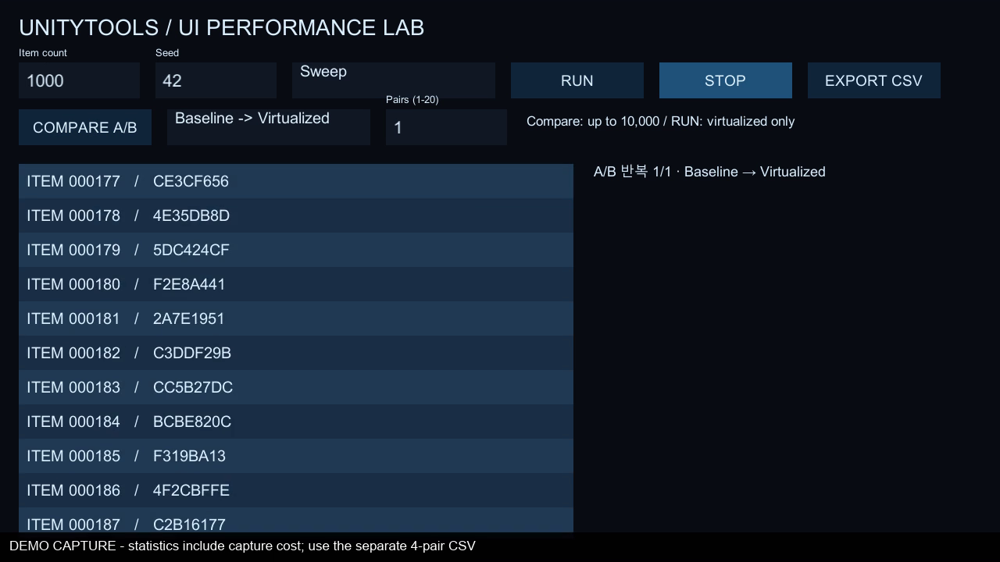

# Windows 포트폴리오 측정 — 2026-10-01

공개 Benchmark 1.0.0과 UI 2.0.0 Git 패키지를 독립 프로젝트에 설치한 Windows x64 Development Player(Mono)의 결과입니다. 자동 시연 도구는 tools/portfolio에 있으며 성능 측정과 영상 캡처 실행을 분리합니다.

## 조건

- Unity 6000.3.20f1 / Windows 11
- AMD Ryzen 9 7900 / NVIDIA GeForce RTX 4060 Ti / RAM 31,863 MB
- Direct3D12 / 1280×720 / Ultra / VSync 0 / target FPS 60
- Sweep / seed 42 / 120 유효 프레임 워밍업 / 600 유효 프레임 표본
- 1,000개 및 10,000개 각각 4쌍, 시작 순서 Baseline → Virtualized 후 매 쌍 교대
- 일반 ScrollRect와 DynamicScroll의 초기화 및 실행 구간을 분리

원본 CSV의 개선율은 각 쌍 `(1 − Virtualized / Baseline) × 100`의 중앙값입니다. 두 중앙값의 비율과 다릅니다. 60 fps 제한으로 프레임 P95는 비슷할 수 있으므로 제한 없는 성능 향상으로 해석하지 않습니다. 메모리는 프로세스 전체이며 같은 프로세스의 allocator 보존과 실행 순서에 영향을 받습니다. 4쌍의 표준편차는 신뢰구간이 아닙니다.

원본 파일·화면·영상은 Benchmark Release에 첨부합니다. 이 PC의 측정은 모바일 기기 성능을 증명하지 않습니다.

## 실제 결과

| 항목 수 | 지표 | Baseline 중앙값 | Virtualized 중앙값 | 쌍별 개선율 중앙값 |
| --- | --- | --- | --- | --- |
| 1,000 | init_ms | 37.817 | 1.226 | 96.589% |
| 1,000 | frame_p95_ms | 16.668 | 16.668 | -0.000% |
| 1,000 | main_thread_p95_ms | 16.689 | 16.691 | 0.003% |
| 1,000 | gc_mean_bytes | 8638.267 | 142.240 | 98.353% |
| 1,000 | peak_memory_bytes | 488343552.000 | 488284160.000 | 0.013% |
| 10,000 | init_ms | 327.557 | 4.409 | 98.735% |
| 10,000 | frame_p95_ms | 38.876 | 16.668 | 57.124% |
| 10,000 | main_thread_p95_ms | 38.864 | 16.689 | 57.063% |
| 10,000 | gc_mean_bytes | 24720.000 | 144.000 | 99.417% |
| 10,000 | peak_memory_bytes | 812560384.000 | 802183168.000 | 0.608% |

초기화·frame P95·Main Thread P95 단위는 ms, GC 평균·peak memory는 bytes입니다. 개선율 음수는 증가(회귀)를 뜻합니다. 전체 객체 수 Baseline은 항목 수에 비례하며 Virtualized는 화면에 필요한 항목 수에 제한됩니다. 자세한 실제 객체 수와 표준편차는 원본 CSV를 참고하세요.

이번 화면 캡처 실패로 4쌍 측정 완료 화면은 제공하지 않습니다. 영상은 별도 1쌍 캡처 실행이고 최종 수치의 화면 증거로 사용하지 않습니다. 원본 CSV와 환경 파일은 완료된 측정 직후 기록했습니다.

영상은 숨겨진 Player의 화면 캡처가 실패하여 시연 전용 카메라·RenderTexture로 같은 UI를 별도 렌더링한 2 fps 기록입니다. OS 창을 촬영한 영상이 아닙니다. 측정 실행에는 이 경로가 없으며 영상 실행에는 측정·집계를 위한 export를 하지 않습니다.

[26.5초 MP4 시연 영상](https://github.com/aassder95/UnityTools/releases/download/unitytools-benchmark/v1.0.0/ui-performance-demo.mp4) · [원본 측정 증거 ZIP](https://github.com/aassder95/UnityTools/releases/download/unitytools-benchmark/v1.0.0/windows-performance-evidence.zip)
